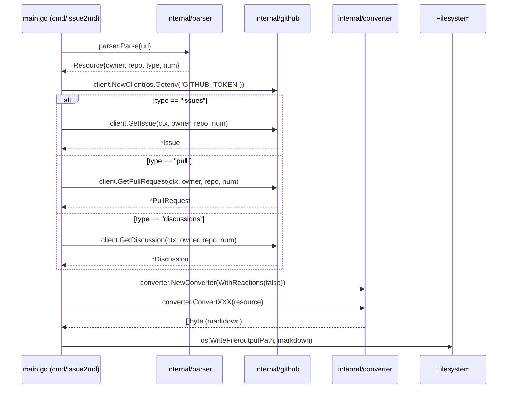

# API Sketch - Internal Package Interfaces

## Version: 1.0
## Scope: issue2md Core Functionality
## Alignment: Internal Cohesion (constitution.md §3.2)

---

## Package Structure Alignment

```go
internal/
├── github/      // GitHub API interactions (§2.1)
├── parser/      // URL parsing and type identification (§2.1.1)
├── converter/   // Data-to-Markdown transformation (§2.2)
├── cli/         // CLI interface (§2.5)
└── config/      // Configuration management
```

---

## internal/github - GitHub API Interaction

### 1. Main Client Interface

```go
// Client represents a GitHub API client abstraction
// Implements: Repository-Resource pattern (constitution.md §1.3)
type Client interface {
    // GetIssue retrieves complete issue data
    // Parameters: context.Context, owner, repo string, number int
    // Returns: (*Issue, error) - Issue with full metadata and comments
    // Error: E002(network), E003(404), E004(403), E005(token invalid)
    GetIssue(ctx context.Context, owner, repo string, number int) (*Issue, error)

    // GetPullRequest retrieves complete PR data
    // Parameters: context.Context, owner, repo string, number int
    // Returns: (*PullRequest, error) - PR with full metadata and comments
    // Error: same as GetIssue
    GetPullRequest(ctx context.Context, owner, repo string, number int) (*PullRequest, error)

    // GetDiscussion retrieves complete discussion data
    // Parameters: context.Context, owner, repo string, number int
    // Returns: (*Discussion, error) - Discussion with full metadata and comments
    // Error: same as GetIssue
    GetDiscussion(ctx context.Context, owner, repo string, number int) (*Discussion, error)
}

// NewClient creates new GitHub client
// Parameters: token string (from os.Getenv("GITHUB_TOKEN"))
// Returns: Client instance
// Notes: token parameter valid only when from environment variable (security)
func NewClient(token string) Client {
    // Implementation: initialize HTTP client with auth header
}
```

### 2. Data Structures (Output)

```go
// Issue represents a GitHub Issue entity
type Issue struct {
    ID          int
    Number      int
    Title       string
    State       string // open, closed
    Body        string // markdown content
    CreatedAt   time.Time
    UpdatedAt   time.Time
    Author      User
    Comments    []Comment
    HTMLURL     string
    Repo        Repository
    Labels      []Label
    Reactions   Reactions  // Main post reactions
}

// PullRequest represents a GitHub Pull Request
type PullRequest struct {
    Issue       // embedded - reuses Issue fields
    Head        Branch
    Base        Branch
    MergeCommit string
}

// Discussion represents a GitHub Discussion
type Discussion struct {
    Category     Category
    // Note: Discussion shares most fields with Issue
}

// Comment represents a single comment
type Comment struct {
    ID          int
    Body        string
    Author      User
    CreatedAt   time.Time
    UpdatedAt   time.Time
    Reactions   Reactions  // Reaction counts
}

// Reactions represents reaction counts for a post
type Reactions struct {
    PlusOne     int  // 👍
    MinusOne    int  // 👎
    Laugh       int  // 😄
    Hurray      int  // 🎉
    Confused    int  // 😕
    Heart       int  // ❤️
    Rocket      int  // 🚀
    Eyes        int  // 👀
}

// Issue now includes reactions
// Comment is embedded above with reactions
// PullRequest and Discussion inherit reactions through embedded Issue

// User represents a GitHub user
type User struct {
    Login     string
    AvatarURL string
    HTMLURL   string
}
```

### 3. Internal Implementation Notes

1. **Security**: No token storage - read from environment variable only
2. **Error Handling**: All errors wrapped with `fmt.Errorf("...: %w", err)` pattern
3. **Authentication**: Bearer token via `Authorization: token {token}`
4. **Rate Limiting**: Should be handled automatically by GitHub
5. **Pagination**: Comments may need pagination handling

---

## internal/parser - URL Parsing and Type Identification

### 1. Main Parser Interface

```go
// Parser handles URL parsing and resource identification
type Parser interface {
    // Parse separates URL into components
    // Parameters: url string - complete GitHub URL
    // Returns: (*Resource, error) - parsed resource identification
    // Error: E001 (invalid URL)
    Parse(url string) (*Resource, error)

    // Validate checks URL format validity
    // Parameters: url string
    // Returns: bool - true if valid GitHub resource URL
    Validate(url string) bool
}

// NewParser creates new parser instance
func NewParser() Parser {
    // Implementation: return regex-based parser
}
```

### 2. Resource Data Structure

```go
// Resource represents parsed GitHub resource
type Resource struct {
    owner       string  // repository owner
    repo        string  // repository name
    resourceType Type    // issues, pull, discussions
    number      int     // issue/pull/discussion number
    rawURL      string  // original URL
}

// Type defines resource categories
type Type string

const (
    TypeIssue      Type = "issues"
    TypePull       Type = "pull"
    TypeDiscussion Type = "discussions"
)
```

### 3. Pattern Support Matrix

| URL Pattern | Supported | ResourceType | Notes |
|------------|-----------|---------------|-------|
| `/issues/{num}` | ✅ | TypeIssue | Primary format |
| `/pull/{num}` | ✅ | TypePull | Primary format |
| `/discussions/{num}` | ✅ | TypeDiscussion | Primary format |
| `/issues?query=` | ❌ | - | Excluded per spec |
| Legacy formats | ❌ | - | Forward compatibility only |

---

## internal/converter - Data-to-Markdown Transformation

### 1. Main Converter Interface

```go
// Converter transforms GitHub resources to Markdown
type Converter interface {
    // ConvertIssue converts Issue to markdown
    // Parameters: *github.Issue
    // Returns: ([]byte, error) - markdown bytes
    // Error: nil (conversion should never fail)
    ConvertIssue(issue *github.Issue) ([]byte, error)

    // ConvertPR converts PullRequest to markdown
    // Parameters: *github.PullRequest
    // Returns: ([]byte, error) - markdown bytes
    // Error: nil (conversion should never fail)
    ConvertPR(pr *github.PullRequest) ([]byte, error)

    // ConvertDiscussion converts Discussion to markdown
    // Parameters: *github.Discussion
    // Returns: ([]byte, error) - markdown bytes
    // Error: nil (conversion should never fail)
    ConvertDiscussion(discussion *github.Discussion) ([]byte, error)
}

// ConverterOption for optional features
type ConverterOption func(*converter) error

// WithReactions enables reaction display
// Parameters: bool - enable reactions
// Returns: ConverterOption
func WithReactions(enabled bool) ConverterOption {
    return func(c *converter) error {
        c.enableReactions = enabled
        return nil
    }
}

// NewConverter creates new converter instance
// Parameters: options...ConverterOption (functional options pattern)
// Note: reactions disabled by default
func NewConverter(options ...ConverterOption) Converter {
    // Implementation: apply options and return markdown template-based converter
    // Default: enableReactions = false
}
```

### 2. Template Structure (internal)

```markdown
# [{Type} #{Number}] {Title}

> **仓库**: [{Owner}/{Repo}]({RepoHTMLURL})
> **状态**: {State}
> **反应表情**: 👍 {{.Reactions.PlusOne}} 👎 {{.Reactions.MinusOne}} 😄 {{.Reactions.Laugh}} 🎉 {{.Reactions.Hurry}} 😕 {{.Reactions.Confused}} ❤️ {{.Reactions.Heart}} 🚀 {{.Reactions.Rocket}} 👀 {{.Reactions.Eyes}}
> **作者**: @{Author.Login}
> **创建时间**: {CreatedAt}
> **更新时间**: {UpdatedAt}
> **评论数**: {len(Comments)}

---

{Body}

---

## 评论 ({len(Comments)})

{range .Comments}### @{.Author.Login} - {.CreatedAt}
{.Body}

👍 {{.Reactions.PlusOne}} 👎 {{.Reactions.MinusOne}} 😄 {{.Reactions.Laugh}} 🎉 {{.Reactions.Hurry}} 😕 {{.Reactions.Confused}} ❤️ {{.Reactions.Heart}} 🚀 {{.Reactions.Rocket}} 👀 {{.Reactions.Eyes}}

{end}
```

### 3. Error Handling
- Uses Go standard library `template` package
- Template syntax error: panic at initialization (fail-fast)
- Data formatting errors: log and continue (recoverable)

---

## Package Cohesion Matrix

| Package | Responsibility | Dependencies | Exposed Interfaces |
|--------|---------------|---------------|----------------------|
| `internal/github` | GitHub API communication | `net/http`,`context` | `Client` |
| `internal/parser` | URL parsing & validation | `regex` | `Parser` |
| `internal/converter` | Markdown rendering | `github`, `template` | `Converter`, `WithReactions` |
| `internal/cli` | CLI interface | `all internal` | - |
| `internal/config` | Configuration | - | `Config` |

---

## Package Isolation Rules

1. **No External Dependencies**: Only stdlib + Go modules
2. **No Cyclic References**: `github` → `converter` only (unidirectional)
3. **No Leaked Abstractions**: Client returned as interface, not struct
4. **No Global State**: Token passed via constructor only

---

## Command Line Integration Flow



---

© 2026 issue2md项目. 保留所有权利。