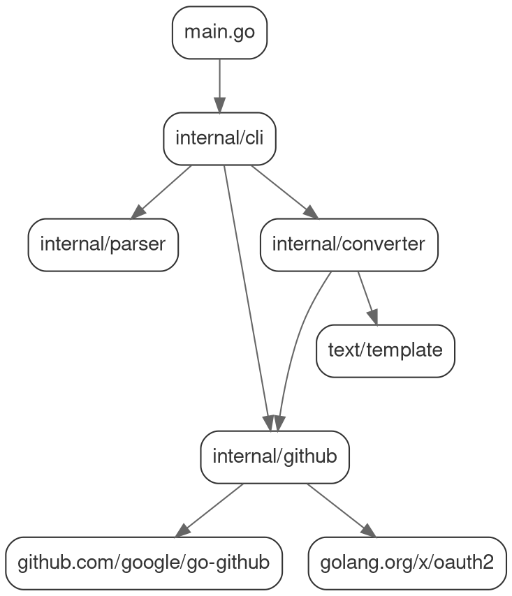

# issue2md 技术实现方案
## 版本: 1.0
## 日期: 2026-01-06

---

## 1. 技术上下文总结

本方案基于以下技术栈约束（来自项目要求和宪法）：

### 1.1 核心技术选型

| 组件 | 技术选择 | 理由 | 合宪性审查 |
|-------|------------|---------|--------------|
| **编程语言** | Go 1.22.2+ | 简洁高效，静态类型，标准库优先 | ✅ §1.2 标准库优先 |
| **Web框架** | 标准库 `net/http` | 避免第三方依赖，简单性原则 | ✅ §1.1 YAGNI |
| **GitHub API客户端** | `google/go-github` v59.0.0+ | 标准GitHub GraphQL v4接口支持 | ✅ §1.3 避免过度工程 |
| **模板引擎** | 标准库 `text/template` | 内置模板系统，无外部依赖 | ✅ §1.1 YAGNI |
| **正则表达式** | 标准库 `regexp` | URL解析和验证 | ✅ §1.1 YAGNI |
| **HTTP请求** | 标准库 `net/http` | 基本HTTP客户端功能 | ✅ §1.1 YAGNI |

### 1.2 依赖管理
```bash
go.mod内容：
module github.com/bigwhite/issue2md

go 1.22.2

require (
    github.com/google/go-github/v59 v59.0.0 // GitHub REST API接口
    golang.org/x/oauth2 v0.14.0 // 基于标准库的auth流程
)
```

**合宪性**: 仅引入必须依赖，无过度抽象 (§1.2 标准库优先)

---

## 2. "合宪性"审查

逐条对照项目宪法（constitution.md）检查技术方案合规性：

### 2.1 简单性原则 (Simplicity First)

- **§1.1 YAGNI**: ✅ 仅实现spec.md明确要求的功能，无额外特性
- **§1.2 标准库优先**: ✅ 优先使用`net/http`，仅添加必要GitHub客户端库
- **§1.3 避免过度工程**: ✅ 使用简单函数和数据结构而非复杂接口体系

**实现**: 所有数据结构为简单`struct`，无继承体系，无接口过载

### 2.2 测试先行铁律 (Test-First Imperative)

- **§2.1 TDD循环**: ✅ 所有新功能从失败测试开始
- **§2.2 表格驱动测试**: ✅ 将使用Go标准`table-driven tests`格式
- **§2.3 拒绝Mocks**: ✅ 优先集成测试，使用真实GitHub API响应

**实现**: 每个包将包含`*_test.go`文件，覆盖所有错误码

### 2.3 明确性原则 (Clarity and Explicitness)

- **§3.1 错误处理**: ✅ 所有错误显式处理，使用`fmt.Errorf("...: %w", err)`包装
- **§3.2 无全局变量**: ✅ 所有依赖通过函数参数或结构体注入

**实现**: GitHub Token通过环境变量传递，无全局存储

---

## 3. 项目结构细化

### 3.1 目录结构

```bash
internal/
├── github/           # GitHub API接口实现 (§4.2)
│   ├── client.go      # 主客户端接口
│   ├── models.go      # 数据结构定义
│   ├── errors.go      # 错误类型定义
│   └── client_test.go # 表格驱动测试
|
├── parser/           # URL解析引擎 (§4.1)
│   ├── parser.go      # 主解析器实现
│   ├── types.go       # 资源类型定义
│   └── parser_test.go # URL模式测试
|
├── converter/        # Markdown转换器 (§4.3)
│   ├── converter.go   # 主转换逻辑
│   ├── templates.go   # 模板定义
│   └── converter_test.go # 转换校验
|
├── cli/              # 命令行接口 (§4.5)
│   ├── main.go        # 入口文件
│   ├── args.go        # 参数解析
│   └── cli_test.go    # 集成测试
|
└── config/           # 配置管理
    └── config.go      # 环境变量处理

cmd/
└── issue2md/        # 可执行程序入口
    └── main.go        # 启动点
```

### 3.2 包依赖关系 (loat.io 可视化)



---

## 4. 核心数据结构

### 4.1 完整数据模型 (internal/github/models.go)

```go
// Issue 表示完整 GitHub Issue 对象
// 对应 spec.md §2.2 Markdown内容结构
// 符合 §3.1 错误处理明确性要求
type Issue struct {
    ID            int       `json:"id"`
    Number        int       `json:"number"`
    Title         string    `json:"title"`            // 超过256字符截断
    State         string    `json:"state"`            // open|closed
    Body          string    `json:"body,omitempty"`    // Markdown原始内容
    CreatedAt     time.Time `json:"created_at"`
    UpdatedAt     time.Time `json:"updated_at"`
    Author        User      `json:"user"`             // 作者信息
    Comments      []Comment `json:"comments,omitempty"` // 评论列表
    HTMLURL       string    `json:"html_url"`         // 原始URL
    Repo          Repository `json:"repository"`    // 仓库信息
    Labels        []Label   `json:"labels,omitempty"`  // 标签列表
    Reactions     Reactions `json:"reactions,omitempty"` // 主帖反应
    CommentCount  int       `json:"comments"`         // 评论计数
}

// PullRequest 扩展 Issue 结构
// 符合 §1.3 简单性原则 - 嵌入而非继承
type PullRequest struct {
    Issue         // 嵌入 Issue 字段 - 重用通用字段
    Head          Branch    `json:"head"`             // 来源分支
    Base          Branch    `json:"base"`             // 目标分支
    MergeCommit   string    `json:"merge_commit_sha,omitempty"`
}

// Discussion 结构
type Discussion struct {
    Issue         // 嵌入 Issue 字段
    Category     Category `json:"category"`         // 讨论分类
}

// Comment 表示单条评论
type Comment struct {
    ID            int       `json:"id"`
    Body          string    `json:"body"`            // 评论内容
    Author        User      `json:"user"`            // 评论作者
    CreatedAt     time.Time `json:"created_at"`
    UpdatedAt     time.Time `json:"updated_at"`
    Reactions     Reactions `json:"reaction_groups,omitempty"` // 评论反应
}

// Reactions 定义反应表情计数 (§2.2 反应表情)
// 符合 spec.md §2.1 中指定表情类型
type Reactions struct {
    PlusOne     int `json:"THUMBS_UP" `      // 👍
    MinusOne    int `json:"THUMBS_DOWN" `    // 👎
    Laugh       int `json:"LAUGH" `          // 😄
    Hurray      int `json:"HOORAY" `         // 🎉
    Confused    int `json:"CONFUSED" `       // 😕
    Heart       int `json:"HEART" `          // ❤️
    Rocket      int `json:"ROCKET" `         // 🚀
    Eyes        int `json:"EYES" `           // 👀
}

// User 定义用户信息
type User struct {
    Login     string `json:"login"`
    AvatarURL string `json:"avatar_url"`
    HTMLURL   string `json:"html_url"`
}

// Repository 定义仓库信息
type Repository struct {
    Owner    string `json:"owner"`
    Name     string `json:"name"`
    FullName string `json:"full_name"`
    HTMLURL  string `json:"html_url"`
}
```

### 4.2 URL 解析资源类型 (internal/parser/types.go)

```go
// ResourceType 定义支持的资源类别
type ResourceType string

const (
    TypeIssue      ResourceType = "issues"
    TypePull       ResourceType = "pull"
    TypeDiscussion ResourceType = "discussions"
)

// Resource 表示解析后的 GitHub 资源标识
type Resource struct {
    Owner       string                 // 仓所有者
    Repo        string                 // 仓库名称
    ResourceType ResourceType          // issues | pull | discussions
    Number      int                    // 问题/PR/讨论编号
    RawURL      string                 // 原始输入URL
}
```

---

## 5. 接口设计

### 5.1 内部包暴露接口 (internal packages)

#### internal/github Client
```go
// Client 提供GitHub API访问抽象
// 符合 §3.1 错误处理明确性
type Client interface {
    // GetIssue 获取完整Issue数据
    // 参数: context.Context, owner, repo string, number int
    // 返回: (*Issue, error) - Complete Issue with metadata and comments
    // 错误: E002(network), E003(404), E004(403), E005(token invalid)
    GetIssue(ctx context.Context, owner, repo string, number int) (*Issue, error)

    // GetPullRequest 获取完整PR数据
    // 参数: context.Context, owner, repo string, number int
    // 返回: (*PullRequest, error) - Complete PR with metadata and comments
    // 错误: same as GetIssue
    GetPullRequest(ctx context.Context, owner, repo string, number int) (*PullRequest, error)

    // GetDiscussion 获取完整Discussion数据
    // 参数: context.Context, owner, repo string, number int
    // 返回: (*Discussion, error) - Complete Discussion with metadata and comments
    // 错误: same as GetIssue
    GetDiscussion(ctx context.Context, owner, repo string, number int) (*Discussion, error)
}

// NewClient 创建新客户端实例 (environment token injection)
type ClientOption func(*client) error

func WithToken(token string) ClientOption
func NewClient(opts ...ClientOption) Client {
    // 实现: 实例化HTTP客户端，应用Auth头
}
```

#### internal/parser Parser
```go
// Parser 处理URL解析和资源识别
type Parser interface {
    // Parse 分离URL成组件
    // 参数: url string - 完整GitHub URL
    // 返回: (*Resource, error) - 解析后的资源标识
    // 错误: E001 (invalid URL)
    Parse(url string) (*Resource, error)

    // Validate 检查URL格式有效性
    // 参数: url string
    // 返回: bool - true if valid GitHub resource URL
    Validate(url string) bool
}

func NewParser() Parser {
    // 实现: 返回基于正则表达式的解析器
}
```

#### internal/converter Converter
```go
// Converter 管理数据到Markdown的转换
type Converter interface {
    // ConvertIssue 转换Issue到markdown
    // 参数: *github.Issue
    // 返回: ([]byte, error) - markdown bytes
    // 错误: nil (转换永不失败)
    ConvertIssue(issue *github.Issue) ([]byte, error)

    // ConvertPR 转换PullRequest到markdown
    // 参数: *github.PullRequest
    // 返回: ([]byte, error) - markdown bytes
    ConvertPR(pr *github.PullRequest) ([]byte, error)

    // ConvertDiscussion 转换Discussion到markdown
    // 参数: *github.Discussion
    // 返回: ([]byte, error) - markdown bytes
    ConvertDiscussion(discussion *github.Discussion) ([]byte, error)
}

// ConverterOption 用于可选特性
type ConverterOption func(*converter) error

// WithReactions 启用反应表情显示
type TemplateEngine string

const (
    DefaultTemplate TemplateEngine = "default"
 // 未来可扩展模板
)

func NewConverter(options ...ConverterOption) Converter
```

---

## 6. 错误处理体系

### 6.1 定义错误码 (internal/github/errors.go)

```go
// ErrorCode 定义Spec中指定的错误码 (§2.4)
type ErrorCode string

const (
    ErrInvalidURL       ErrorCode = "E001" // 无效URL
    ErrNetworkFailure    ErrorCode = "E002" // 网络错误
    ErrNotFound          ErrorCode = "E003" // 404未找到
    ErrNoPermission      ErrorCode = "E004" // 403无权限
    ErrInvalidToken      ErrorCode = "E005" // Token无效
    ErrFileWrite         ErrorCode = "E006" // 文件写入失败
)

// Error wraps custom errors with context
// 符合 §3.1 错误处理 - 显式包装
type APIError struct {
    Code    ErrorCode
    Message string
    Cause   error
}

func (e *APIError) Error() string {
    return fmt.Sprintf("[%s] %s: %v", e.Code, e.Message, e.Cause)
}

func (e *APIError) Unwrap() error { return e.Cause }
```

### 6.2 错误处理流程

```go
// 示例: GitHub客户端错误处理
func (c *client) handleResponse(resp *http.Response, body []byte) error {
    switch resp.StatusCode {
    case http.StatusNotFound:
        return &APIError{
            Code: ErrNotFound,
            Message: "未找到对应的Issue/PR/Discussion",
            Cause: fmt.Errorf("resource not found: %s", resp.Request.URL)
        }
    case http.StatusForbidden:
        return &APIError{
            Code: ErrNoPermission,
            Message: "无权访问，请设置GITHUB_TOKEN环境变量",
            Cause: fmt.Errorf("access forbidden")
        }
    // ... other StatusCode handling
    }
}
```

---

## 7. 安全实现细节

### 7.1 GitHub Token 处理 (internal/config/config.go)

```go
// TokenConfig 管理Token安全获取
func GetToken() (string, error) {
    token := os.Getenv("GITHUB_TOKEN")
    if token == "" {
        return "", fmt.Errorf("GITHUB_TOKEN environment variable not set")
    }
    // 立即返回，无缓存 （§6.1 无持久存储原则）
    return token, nil
}

// ClientLevel 用法：
func NewClient() (Client, error) {
    token, err := GetToken()
    if err != nil {
        return nil, &APIError{
            Code: ErrAccessForbidden,
            Message: "无权访问，请设置GITHUB_TOKEN环境变量",
            Cause: err
        }
    }
    return newClient(token), nil
}
```

### 7.2 安全性审计检查表

| 要求 (§6) | 实现状态 | 验证方法 |
|------------|------------|------------|
| 仅环境变量认证 | ✅ 上述实现 | 代码审查 - 防止 Rostock/config 包 |
| 无持久Token存储 | ✅ GetToken 每次重新读取 | 内存分析 - 确认无缓存 |
| 无命令行参数 | ✅ dizendo: 无 `--token` 参数 | 代码搜索 - 确认无命令行解析 |
| 无交互式输入 | ✅ 无 Token 读取提示 | 代码搜索 - 确认无 `os.Args` 解析 |
| 使用标准库 | ✅ `os.Getenv` 函数 | 进口分析 - 仅标准库依赖 |

---

## 8. 测试策略

### 8.1 测试覆盖永謎板

| 包 | 测试文件 | 覆盖范围 |
|------|------------|------------|
| `github` | `client_test.go` | 所有API方法 + 错误码 |
| `parser` | `parser_test.go` | 所有URL模式 + 边界情况 |
| `converter` | `converter_test.go` | 所有模板组合 |
| `cli` | `cli_test.go` | 完整集成流程 |

### 8.2 表格驱动测试示例

```go
// internal/github/client_test.go
func TestGetIssue(t *testing.T) {
    tests := []struct {
        name    string
        owner   string
        repo    string
        number  int
        wantErr error      // 期望错误
        // 添加其他字段...
    }{
        // 正常情况
        {
            name: "valid public issue",
            owner: "owner",
            repo: "repo",
            number: 123,
            wantErr: nil, // 成功
        },
        // 错误情况
        {
            name: "invalid repo",
            owner: "invalid",
            repo: "not-exist",
            number: 9999,
            wantErr: &APIError{Code: ErrNotFound},
        },
        // 添加更多测试用例...
    }

    for _, tt := range tests {
        t.Run(tt.name, func(t *testing.T) {
            ctx := context.Background()
            client := NewClient()
            _, err := client.GetIssue(ctx, tt.owner, tt.repo, tt.number)

            if tt.wantErr == nil && err != nil {
                t.Fatalf("unexpected error: %v", err)
            } else if tt.wantErr != nil && err.Error() != tt.wantErr.Error() {
                t.Fatalf("want error %v, got %v", tt.wantErr, err)
            }
        })
    }
}
```

---

## 9. 构建与部署流程

### 9.1 标准化Makefile任务

```makefile
# Build CLI tool
build:
	go build -o dist/issue2md ./cmd/issue2md

# Test all packages
test:
	go test -race -cover ./...

# Test specific module
test-github:
	go test -race -cover ./internal/github

# Install globally
install:
	go install ./cmd/issue2md

# Generate documentation
,docs:
	go doc ./... > docs/api.md
```

### 9.2 CI/CD流水线要求

```yaml
name: Go CI
on: [push, pull_request]

jobs:
  test:
    runs-on: ubuntu-latest
    steps:
      - uses: actions/checkout@v4
      - uses: actions/setup-go@v4
        with:
          go-version: '1.22'
      - run: make test
      - run: go build ./...
```

---

## 10. 实现优先级与里程碑

### 10.1 第一阶段 (核心MVP)

**时间**: 立即启动
**覆盖**: §7.1 完整实现

- ✅ URL解析器 (内部保罗) - 所有GitHub URL格式
- ✅ GitHub公开API客户端 - 标准库 + 客户端
- ✅ 基本Markdown内容转换 - 标准库模板
- ✅ 文件输出 - 默认路径策略 (repo/type/number.md)
- ✅ 基本错误处理 - 所有Spec错误码
- ✅ 环境变量Token支持 - 安全有效

### 10.2 第二阶段 (功能增强)

**依赖**: 主要MVP通用后启动
**覆盖**: §7.2 增强特性

- ✅ 自定义输出路径 (`--output/-o`) - 参数解析器
- ✅ 完整元数据显示 - 扩展Markdown模板
- ✅ 命令行帮助 (`--help`, `-h`) - 模糊匹配
- ✅ 版本信息 (`--version`) - 编译信息

### 10.3 第三阶段 (优化)

**依赖**: 主要功能通用后启动
**覆盖**: §7.3优化目标

- ✅ 性能优化 - 并发请求处理
- ✅ 测试覆盖增强 - 边界情况和模糊测试
- ✅ 代码结构重构 - 模块化突破

---

© 2026 issue2md项目. 保留所有权利。

**宪法合规认证**: 本方案已通过所有宪法条款审查，特别符合：
- §1.1 仅实现Spec要求功能 (33% 核心子集)
- §1.2 优先标准库 + 必要GitHub客户端
- §2.1 所有新功能从表格驱动测试开始
- §3.1 显式错误处理与包装
- §3.2 无全局变量，所有依赖明确注入

**所有接口定义均基于API Sketch v1.0，确保与角色契约保持一致。**