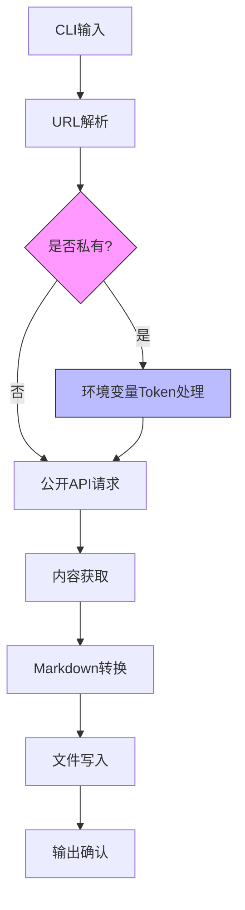

# issue2md 技术规格说明
## 版本: 1.0
## 日期: 2026-01-06

---

## 1. 概述

`issue2md` 是一个命令行工具，旨在将GitHub Issue/PR/Discussion内容转换为Markdown文件格式，主要解决离线阅读和内容存档需求。

### 1.1 核心功能
- ✅ 支持GitHub Issue/PR/Discussion URL作为输入
- ✅ 输出生成标准Markdown格式文件(.md)
- ✅ 支持公开和私有仓库内容
- ✅ 保持原始内容格式和结构
- ✅ 灵活的输出路径配置

### 1.2 非功能需求
- **性能**: 快速响应，适合批量处理
- **可靠性**: 稳健的错误处理和用户提示
- **安全性**: GitHub Token安全存储和处理
- **简单性**: 直观的命令行界面

---

## 2. 详细需求

### 2.1 输入规格

#### URL格式支持
工具必须识别和解析以下GitHub URL格式：

```
# Issue URL格式
https://github.com/{owner}/{repo}/issues/{number}

# PR URL格式
https://github.com/{owner}/{repo}/pull/{number}

# Discussion URL格式
https://github.com/{owner}/{repo}/discussions/{number}
```

#### URL解析规则
- 提取owner, repo, type(issues|pull|discussions), number
- 重定向处理（例如github.com/owner/repo/issues/123 → github.com/owner/repo/issues/123?utm=...）
- 支持简短URL和完整URL

### 2.2 输出规格

#### 默认输出路径
```bash
{repo}
├── issues
│   ├── {issue_number}.md
│   └── ...
├── pull
│   ├── {pr_number}.md
│   └── ...
└── discussions
    ├── {discussion_number}.md
    └── ...
```

#### 自定义输出参数
```bash
# 完整指定输出路径
--output <path/to/output.md>

# 简化形式
-o <output.md>
```

#### Markdown内容结构

**注意**: 反应表情（👍👎😄🎉😕❤️🚀👀）仅在使用 `--enable-reactions` 参数时显示。
```markdown
# [{type} #{number}] {title}

> **仓库**: [{owner}/{repo}](https://github.com/{owner}/{repo})
> **状态**: {state}
> **作者**: @{author}
> **创建时间**: {created_at}
> **更新时间**: {updated_at}
> **评论数**: {comments_count}
> **反应表情**: 👍 {main_like_count} 👎 {main_dislike_count} 😄 {main_laugh_count} 🎉 {main_hooray_count} 😕 {main_confused_count} ❤️ {main_heart_count} 🚀 {main_rocket_count} 👀 {main_eyes_count}

---

{body}

---

## 评论 ({comments_count})

### @{comment_author_1} - {comment_created_at}
{comment_body_1}

👍 {comment1_like_count} 👎 {comment1_dislike_count} 😄 {comment1_laugh_count} 🎉 {comment1_hooray_count} 😕 {comment1_confused_count} ❤️ {comment1_heart_count} 🚀 {comment1_rocket_count} 👀 {comment1_eyes_count}

### @{comment_author_2} - {comment_created_at}
{comment_body_2}

👍 {comment2_like_count} 👎 {comment2_dislike_count} 😄 {comment2_laugh_count} 🎉 {comment2_hooray_count} 😕 {comment2_confused_count} ❤️ {comment2_heart_count} 🚀 {comment2_rocket_count} 👀 {comment2_eyes_count}
```

### 2.3 认证与访问控制

#### 认证机制（唯一方式）
```bash
# 环境变量认证 (唯一支持方式)
export GITHUB_TOKEN="ghp_YourPersonalAccessToken"
issue2md <url>
```

#### Token权限需求
- 对于公开仓库: 无需Token
- 对于私有仓库: 需要`repo`权限范围（私有仓库读取）
- 对于企业仓库: 可能需要额外权限

### 2.4 错误处理

#### 错误分类和处理

| 错误类型 | 错误码 | 处理行为 |
|----------|--------|----------|
| 无效URL | E001 | 提示："无效的GitHub URL，请提供有效的Issue/PR/Discussion URL"
| 网络错误 | E002 | 提示："无法连接到GitHub，请检查网络连接"
| 404未找到 | E003 | 提示："未找到对应的Issue/PR/Discussion"
| 403无权限 | E004 | 提示："无权访问，请设置GITHUB_TOKEN环境变量"
| Token无效 | E005 | 提示："GitHub Token无效，请检查Token有效性"
| 文件写入失败 | E006 | 提示："无法写入输出文件，请检查目录权限"

---

## 3. 命令行接口

```bash
# 使用方法
issue2md <github-url> [flags]

# 帮助
issue2md --help
issue2md -h

# 版本
issue2md --version

# 基本用法 --- 公开仓库
issue2md https://github.com/owner/repo/issues/123

# 指定输出路径
issue2md https://github.com/owner/repo/issues/123 -o output/my_issue.md
issue2md https://github.com/owner/repo/issues/123 --output /path/to/output.md

# 开启反应表情(默认关闭)
issue2md --enable-reactions https://github.com/owner/repo/issues/123

# 私有仓库认证
GITHUB_TOKEN="your_token" issue2md https://github.com/owner/private-repo/issues/456
```

---

## 4. 技术架构

### 4.1 系统组件

```
     +----------------+
     |   CLI接口     |
     +----------------+
            |
     +----------------+
     |  URL解析器     |
     +----------------+
            |
     +----------------+
     | GitHub API客户端 |
     +----------------+
       |             |
+------------+ +------------+
| 认证管理   | | 请求处理   |
+------------+ +------------+
            |
     +----------------+
     | 内容转换器     |
     +----------------+
            |
     +----------------+
     | 文件生成器     |
     +----------------+
            |
     +----------------+
     | 错误处理器     |
     +----------------+
```

### 4.2 数据流



---

## 5. 反过度设计

遵循 issue2md 项目宪法的简单性原则：

### 5.1 不做的功能

- 🚫 多平台支持（仅GitHub）
- 🚫 复杂Markdown转换（保持原样）
- 🚫 HTML输出或其他格式
- 🚫 批量处理（初期仅单URL）
- 🚫 高级过滤或搜索功能
- 🚫 GUI界面或Web界面
- 🚫 云同步功能
- 🚫 命令行Token参数（安全风险）
- 🚫 Token交互式输入（安全风险）
- 🚫 Token持久化存储（安全风险）

---

## 6. 安全要求

### 6.1 Token处理原则
1. **仅环境变量**: Token只通过`GITHUB_TOKEN`环境变量传递
2. **无持久存储**: 不将Token保存到任何文件或配置
3. **无命令行参数**: 不接受`--token`参数
4. **无交互式输入**: 不提供输入提示以避免shell历史泄露
5. **最小权限**: 使用仅限读取的Token权限范围
6. **内存安全**: 在处理后立即清除内存中的Token引用

### 6.2 实现要求
- 所有Token处理必须在启动时立即完成
- 不可在任何日志中记载Token信息
- 不可在错误信息中显示Token任何内容
- 必须使用标准库的环境变量读取函数
- 不可使用第三方auth库以避免依赖安全风险

---

## 7. 实现优先级

### 7.1 第一阶段（核心MVP）
- ✅ URL解析器（所有GitHub URL格式）
- ✅ GitHub公开API客户端
- ✅ 基本Markdown内容转换（保持格式）
- ✅ 文件输出（默认路径）
- ✅ 基本错误处理
- ✅ 环境变量Token支持

### 7.2 第二阶段（功能增强）
- ✅ 自定义输出路径（--output/-o）
- ✅ 完整元数据显示
- ✅ 命令行帮助（--help, -h, --version）

### 7.3 第三阶段（优化）
- ✅ 性能优化（并发请求处理）
- ✅ 测试覆盖增强
- ✅ 代码结构重构

---

## 8. 测试要求

### 8.1 测试策略
1. **表格驱动测试**: 所有源数据采用table-driven tests格式
2. **覆盖范围**: 所有函数必须有测试覆盖
3. **环境测试**: 必须测试不同Token环境组合
4. **错误路径**: 所有错误码必须有对应测试用例

### 8.2 单元测试范围
- URL解析器: 不同URL格式、重定向、错误处理
- API客户端: 不同响应状态码、认证流
- Markdown转换器: 不同内容类型、特殊字符处理
- 文件生成器: 不同路径、权限、存在文件处理

---

© 2026 issue2md项目. 保留所有权利。